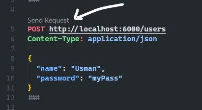

# Simple User Auth in Node.js

This repo contains some code about simple User Authentication in Node.js. Using Express and Bcrypt to hash passwords.

## To test it out:

- Clone this repo
- Run `npm i` or `yarn` to install packages

## Making Requests

### Inside Visual Studio Code

If you want to do this inside Visual Studio Code, you can install the [REST Client](https://marketplace.visualstudio.com/items?itemName=humao.rest-client) extension and click **Send Request** in the `request.rest` file

Instead, you can send requests using [Postman](https://www.postman.com/) or [Insomnia](https://insomnia.rest/download).
